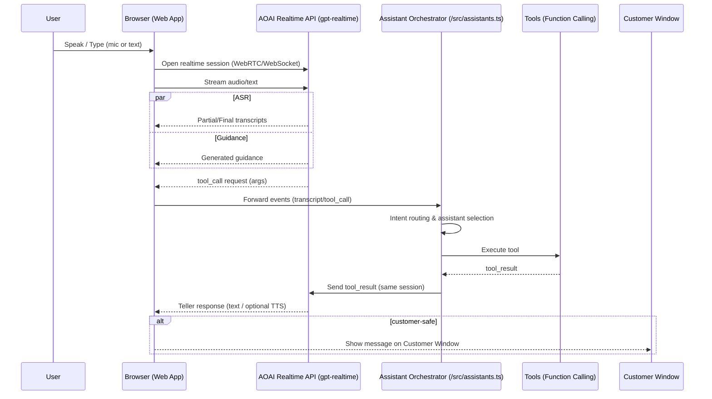

```mermaid
sequenceDiagram
  participant U as User
  participant B as Browser (Web App)
  participant R as AOAI Realtime API (gpt-realtime)
  participant O as Assistant Orchestrator (/src/assistants.ts)
  participant T as Tools (Function Calling)
  participant C as Customer Window
  U->>B: Speak / Type (mic or text)
  B->>R: Open realtime session (WebRTC/WebSocket)
  B->>R: Stream audio/text

  par ASR
    R-->>B: Partial/Final transcripts
  and Guidance
    R-->>B: Generated guidance
  end
  R-->>B: tool_call request (args)
  B->>O: Forward events (transcript/tool_call)
  O->>O: Intent routing & assistant selection
  O->>T: Execute tool
  T-->>O: tool_result
  O->>R: Send tool_result (same session)

  R-->>B: Teller response (text / optional TTS)

  alt customer-safe
    B-->>C: Show message on Customer Window
  end
```