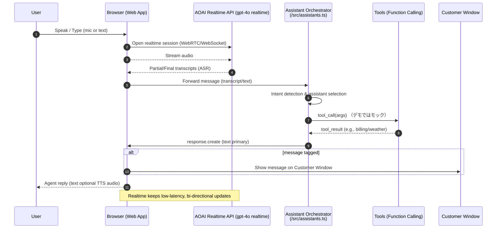

```mermaid
sequenceDiagram
    autonumber
    participant U as User
    participant B as Browser (Web App)
    participant R as AOAI Realtime API (gpt-4o realtime)
    participant O as Assistant Orchestrator<br/>(/src/assistants.ts)
    participant T as Tools (Function Calling)
    participant C as Customer Window

    U->>B: Speak / Type (mic or text)
    B->>R: Open realtime session (WebRTC/WebSocket)
    B-->>R: Stream audio
    R-->>B: Partial/Final transcripts (ASR)

    B->>O: Forward message (transcript/text)
    O->>O: Intent detection & assistant selection
    O->>T: tool_call(args)  （デモではモック）
    T-->>O: tool_result (e.g., billing/weather)

    O->>B: response.create (text primary)
    alt message tagged ###InfoToCustomer###
        B->>C: Show message on Customer Window
    end

    B-->>U: Agent reply (text optional TTS audio)
    Note over B,R: Realtime keeps low-latency, bi-directional updates
```